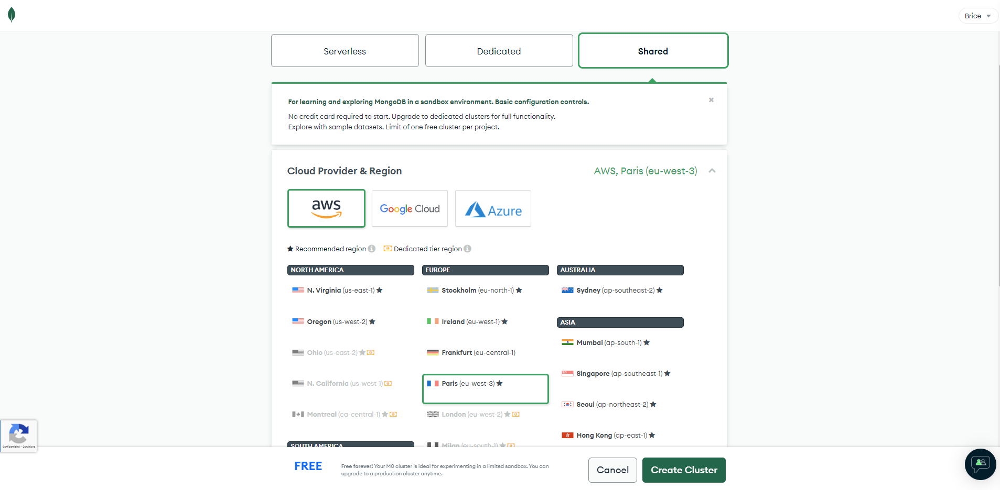
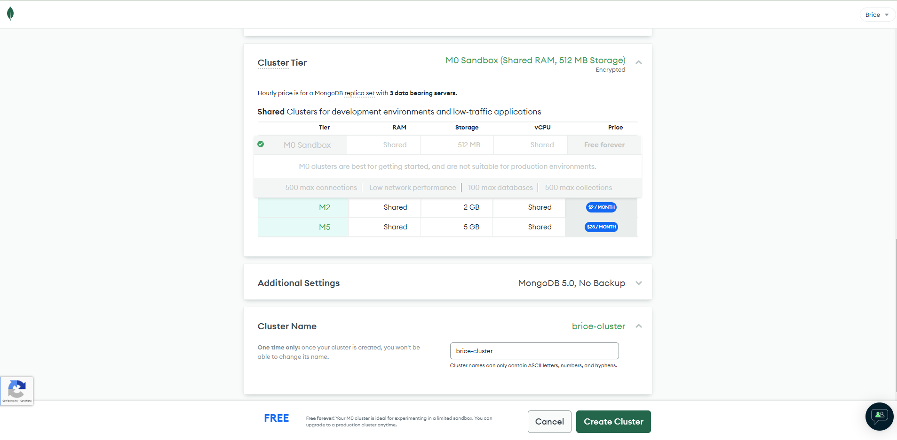
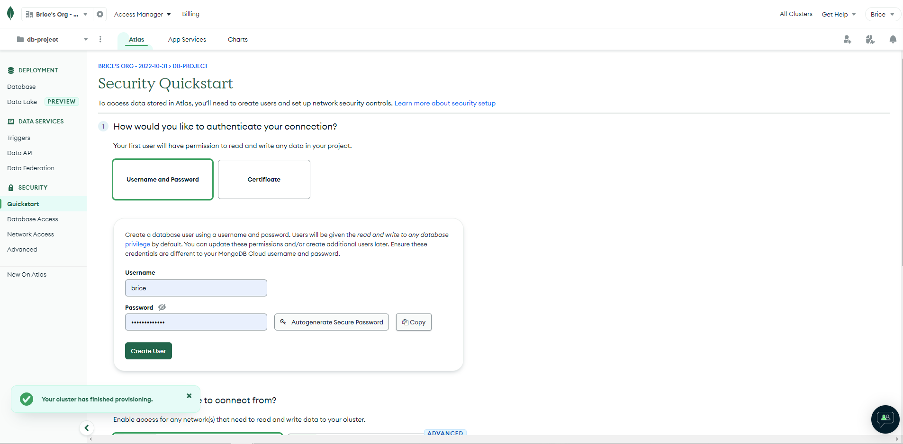
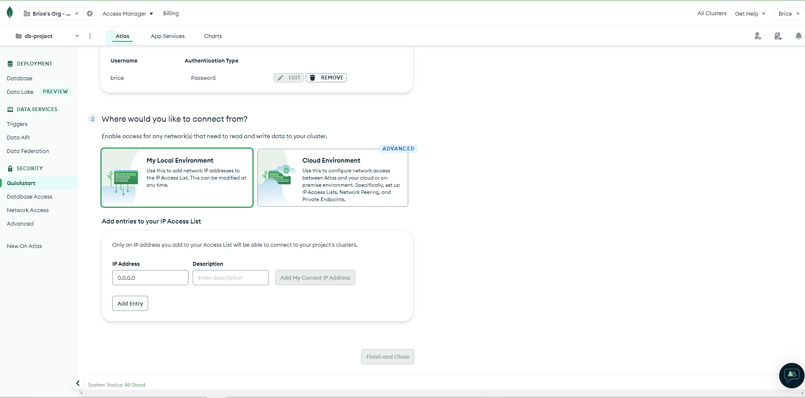
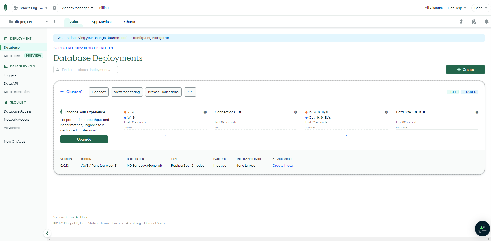
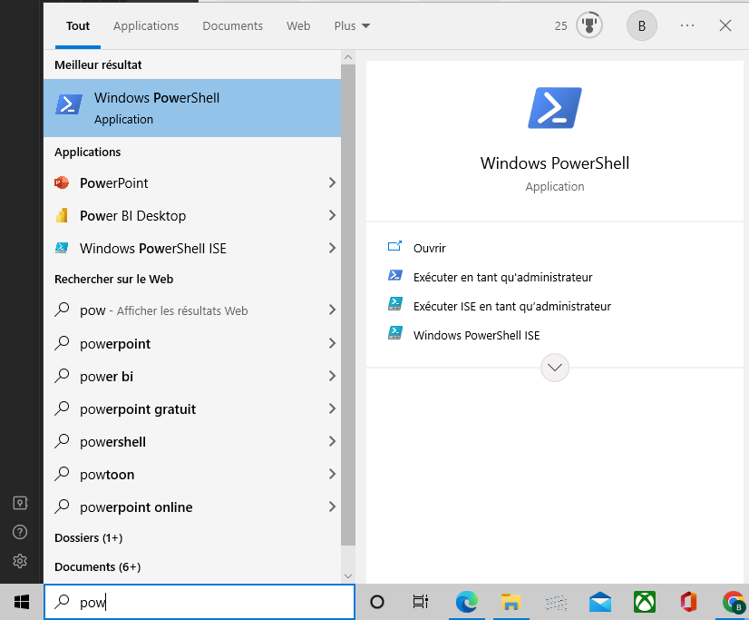
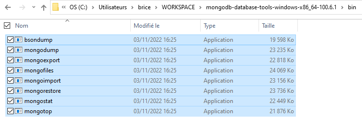

# Configurations et prérequis 
Pour cette séance de TP, nous aurons besoin de :

- [Créer un bac à sable](#créer-une-sandbox-ou-bac-à-sable)
- [Charger des échantillons de données](#charger-des-echantillons-de-donnees)
- [Installer un serveur MongoDB](#installer-mongodb-server)
- [Installer Mongo Shell](#installer-mongo-shell)
- [Installer les outils Mongo](#installer-les-outils-mongo)
## **Créer une sandbox ou bac à sable**
Aller sur la page: https://www.mongodb.com/docs/atlas/.
Cliquer sur **Try Free** et créer un compte en remplissant le formulaire.
Une fois le compte créé, MongoDB vous propose la création d'un cluster.
### **Choix du fournisseur Cloud**
Vous devez choisir un fournisseur cloud pour votre serveur de base de données.
L'option **Shared** vous donne accès à des clusters gratuits. Les providers vous proposent différentes régions où sont hébergés les serveurs.
En règle générale, pour l'efficacité des interactions avec le serveur, il est recommandé de choisir la région la plus proche de sa position géographique.
>Dans notre cas, il s'agit de **Paris** pour le provider AWS. Si l'on souhaite travailler avec Google Cloud, la région la plus proche est la Belgique.



Une fois la région choisie, donner un nom au cluster.
Les autres configurations ne sont pas à modifier.



Cliquer sur **Create Cluster** pour valider l'opération.
### **Création d'un projet**
Une fois un cluster créé, on peut ajouter un projet. Créer un projet en lui associant un nom.


### **Création d'une base de données**
Une fois votre projet créée, créer une base de données à déployer rapidement. Cliquer sur **Build a Database**.


Choisir l'option **Shared** une nouvelle fois, car elle gratuite.


### **Création d'un utilisateur**
Créer un utilisateur (username+password) pour sa base de données.
Vous pouvez utiliser ces identifiants, ou les personnaliser :
**Username** es901-student
**Password** es901-mongodb-intro.
<span style="background:red; color:white"><b>Attention :</b> Pour la suite des TPs, ne pas mettre de caractères spéciaux dans votre mot de passe.</span>



Une fois l'utilisateur créée et la base de données provisionnée, il faut gérer l'accès réseau à cette dernière.
### **Sécurité réseaux**
Dans cette étape, il faut spécifier les adresses IP depuis lesquelles un utilisateur peut se connecter.


Les configurations terminées, on obtient cet écran avec une base de données déployée, à laquelle nous pourrons nous connecter plus tard.


Afin de se connecter, nous aurons besoin d'une chaine de connexion. Récupérez là en cliquant sur **Connect**.
Ensuite, choisissez **Connect using MongoDB Compass**, sélectionner votre système d'exploitation, puis copier l'URL de connexion qui ressemble à celle ci :  `mongodb+srv://brice:<password>@cluster0.5cy4vr9.mongodb.net/test`.


Nous nous servirons de cette URL dans nos prochaines séances de TP.

##**Charger des échantillons de données**

Une fois votre base de données créée et configurée, cliquez sur les 3 points (...), puis sélectionnez then **Load Sample Dataset**, comme ci-dessous
    


Cliquez sur **Load Sample Dataset** Le chargement des données va démarrer et durer quelques instants. 

Une fois le chargement terminé, cliquez sur **Browse Collections** pour consulter les données via l'explorateur.

Consultez et sélectionnez des bases de données et collections dans l'onglet Collection à la gauche de l'écran.


Une fois que vos données sont chargées, suivez la suite des instructions.

## **Installer MongoDB server**
Télécharger le serveur Mongo DB via le lien suivant :
https://www.mongodb.com/try/download/community
Choisir le fichier .msi pour installer correctement Mongo.
Une fois l'installation terminée, ajouter le chemin `C:\Program Files\MongoDB\Server\6.0\bin` de Mongo DB à la variable d'envrionnment Path du système.
### **Ajouter le bin au Path**
- Ouvrir la barre de recherche dans "Démarrer",  cherchez “Edit the system environment variables” ou "Modifier les variables d'environnement système" en Français :

   
[](https://www.architectryan.com/static/start_menu-91c0473bae32fa3862658e4d6e62d75c-2facb.png)

-   Cliquer sur le bouton “Environment Variables…”. 
- [](https://www.architectryan.com/static/system_properties-f3a4f86cdd178c48ed9d8398743f85df-39c95.png)

-   Sous la section “System Variables”, trouver la variable **Path** et cliquer sur "Edit"  
[](https://www.architectryan.com/static/select_row_and_edit-48423a2a0724e226bd3f69468d9eaabd-70c4b.png)

-   L'interface “Edit environment variable” va apparaître. Cliquer sur "New" pour ajouter une nouvelle valeur et insérer le chemin des fichiers binaires de MongoDB soit `C:\Program Files\MongoDB\Server\6.0\bin`.[](https://www.architectryan.com/static/edit_path_variable-42eb044d39582f04f1f213e17e4fcb30-c532b.png)

-   Cliquer sur "OK" pour sauvegarder cette modification.

-   La prise en compte de cette modification pourraît nécessiter le redémarrage de la machine.

-   Pour vérifier l'ajout de cette variable, ouvrir un terminal PowerShell:

    

  - Exécuter la commande suivante et vérifier que le chemin ajouté est bien dans la liste affichée
    ```PowerShell
    $env:PATH
    ```
Si ce n'est pas le cas, redémarrer la machine.
Une fois la machine redémarrée, on peut ajouter des scripts de Mongo dans ce chemin afin de les utiliser.
## **Installer Mongo Shell**
Télécharger la version zip du Shell de Mongo DB.
https://www.mongodb.com/try/download/shell
Une fois téléchargée, extraire le contenu du fichier zip.
Ensuite, naviguer jusqu'au dossier bin de cette librairie. Copier et coller le contenu (notamment le script `mongosh`) vers `C:\Program Files\MongoDB\Server\6.0\bin`.
## **Installer les outils Mongo**
Télécharger la version zip des outils de BDD de Mongo DB
https://www.mongodb.com/try/download/database-tools.
Ensuite, naviguer jusqu'au dossier bin de cette librairie.



Copier et coller le contenu (cf. image) vers `C:\Program Files\MongoDB\Server\6.0\bin`.


Pour vérifier que ces scripts sont exécutables, ouvrir un nouveau terminal et exécutez quelques commandes.

```PowerShell
mongodump
```

Si le résultat de cette commande est le suivant :
>'mongodump' n’est pas reconnu en tant que commande interne
ou externe, un programme exécutable ou un fichier de commandes.

Alors les scripts n'ont pas été correctement installés.

  

