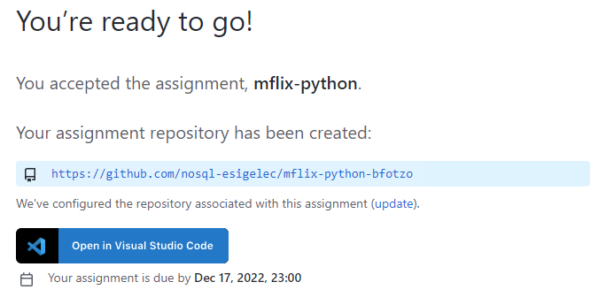

# TP 2 : MongoDB avec Python

Dans ce TP, nous allons découvrir l'utilisation de MongoDB avec le driver officiel Python : **PyMongo**.

Ce TP s'articulera en 2 parties:
- **Notebook** 

Dans un [notebook](getting_started_with_pymongo.ipynb), nous ferons une introduction à l'utilisation de PyMongo.
- **MFLIX**

Nous utiliserons le projet MFLIX, en guise de cas pratique. C'est une application dont l'interface graphique est développée, mais il manque des fonctionnalités à implémenter notamment celles qui interagissent avec la base de données. 
 
Il s'agit d'une application web permettant de consulter et de noter des films.
Son interface graphique est développée, mais il manque des fonctionnalités à implémenter notamment celles qui interagissent avec la base de données. 

Durant le TP, nous allons mettre en place des requêtes permettant à des utilisateurs de :

- Chercher des films par pays 
- Chercher des films par acteurs, genre, contenu textuel
- Consulter les pages suivantes de films 
- Me créer un compte, me connecter et me déconnecter 
- Enregistrer mes préférences telles que mon acteur favori ou langue préférée 
- Voire les commentaires pour un film 
- Poster des commentaires sur un film 

À la fin de ce TP, vous devrez être capable de :

- Se connecter à une base de données MongoDB via PyMongo
- Insérer des documents dans une application python via PyMongo
- Exécuter des requêtes sur des collections depuis une application python via Mongo
- Modifier des documents dans une application python via PyMongo
- Supprimer des documents, collections dans une application python via PyMongo

Afin de mener à bien ce TP, bien vouloir prendre connaissance des informations suivantes:

# Projet MFlix 

MFlix a deux composantes principales:

-   **_Frontend_**: Toutes les fonctionnalités de l’interface utilisateur sont déjà implémentées pour vous, ce qui inclut une application React intégrée dont vous n’avez pas à vous soucier.
-   **_Backend_**: Le projet, qui fournit le service nécessaire à l’application. Le code est déjà mis en œuvre sauf certaines fonctions que vous devrez implémenter.

Vous ne modifierez que les fonctions qui ont une interaction avec MongoDB.
# Sommaire

-   Les consignes d'implémentation sont dans le fichie [build_queries_with_pymongo.md](build_queries_with_pymongo.md)
-   La couche API est implémentée par `movies.py` et `user.py`  dans le dossier ``**mflix/api**`` 
    -   Ces fichiers ne sont pas à modifier
-   `db.py`  contient toutes les méthodes qui interagissent avec la base de données
    -   C'est ce fichier qui devra être modifié pour implémenter les fontionnalités demandées
-   Le dossier **``tests``**  contient tous les tests unitaires
    - Ces tests seront à exécuter pour valider les résultats
    - Il est recommandé de mettre l'accent le passage des tests un par un, plutôt qu'en une fois 
# Bases de données

Nous utiliserons _MongoDB Atlas_, la Database as a Service (DBaaS) de MongoDB, il faudra avoir crée un cluster Atlas au préalable. 

Afin d'être correctement exécuté, le projet MFlix a besoin que certaines dépendances soient installées au préalable. Elles sont listées dans le fichier `requirements.txt`.

# Environnement de développement 

## IDE
Choisissez un IDE pour exécuter et tester votre code. Je recommande **[PyCharm Community Edition](https://www.jetbrains.com/pycharm/download/)** et **[Visual Studio Code](https://code.visualstudio.com/)**.
Une fois un IDE choisi, récupérez le code du projet [](https://classroom.github.com/a/OMzGRSF0) en suivant les étapes :
- Se Connecter ou créer un compte GitHub 
- Cliquer sur "Accept this assignment"
- Actualiser l'écran. 
- Choisissez votre nom dans la liste des étudiants
- Cliquer sur Open in Visual Studio Code


## Anaconda
Nous allons utiliser  Anaconda  pour installer Python 3.7 et gérer l'environnement.
> Installer Anaconda si besoin via https://www.anaconda.com/products/distribution

Avec Ananconda, créer un et activer un environnement. 

```shell
# enter mflix-python folder
cd mflix-python-{username}

# create a new environment for MFlix
conda create --name mflix python=3.7

# activate the environment
activate mflix
```

## Dépendances Python

Une fois que Python 3.7 est installé, installer les dépendances via la commande:
```
pip install -r requirements.txt
```

# Exécuter l'application

À la racine du projet, se trouvent 2 fichiers dotini.
Ouvrir ce fichier et saisir la chaine de connection de son cluster Atlas.
Rassurez-vous de mettre cette information entre quotes comme ci-dessous:

```
MFLIX_DB_URI = "mongodb+srv://..."
```

Renommer ce fichier .ini avec l'une des commandes:  

```
ren dotini_win .ini # on Windows
mv dotini_unix .ini  # on Unix
```

_Note:_ Une fois renommé, il se peut que le fichier ne soit plus visible via l'explorateur de fichier.
Vous pouvez cependant l'ouvrir à l'aide d'une des commandes :
```
vi .ini       # on Unix
notepad .ini  # on Windows
```

Une fois cette configuration terminée, vous pouvez lancer l'application MFlix :  

```
python run.py
```

Vous pourreez accéder à votre application via ce lien  [http://localhost:5000/](http://localhost:5000/).

# Exécutez les tests unitaires

Pour exécuter des tests unitaires, vous utiliserez pytest. Il vous faudra être à la racine du projet pour exécuter les commandes de tests.

```
pytest -m module-to-test
```

Les noms de modules sont dans le fichier `pytest.ini`

Pour commencer le TP, cliquer sur [](build_queries_with_pymongo.md)


